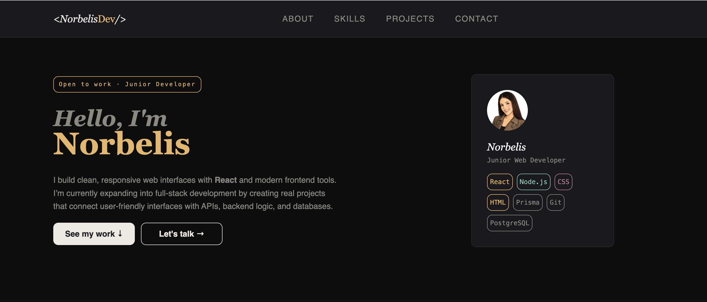
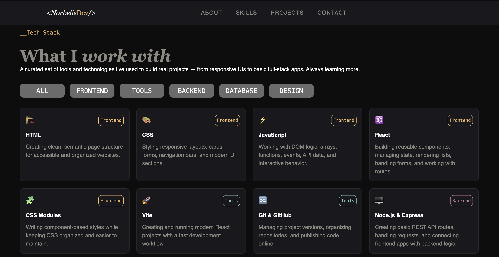
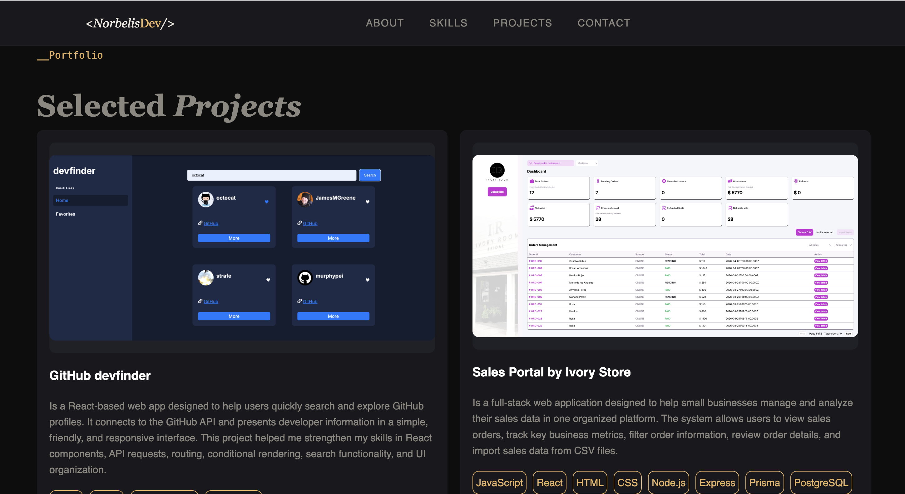
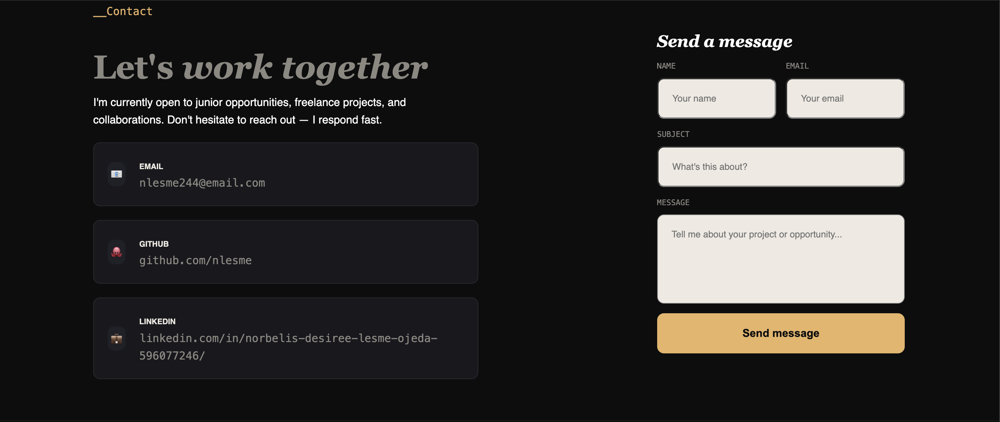

# Personal Portfolio

This is my personal web developer portfolio built with React and Vite.  
The goal of this project is to present my skills, selected projects, and contact information in a clean, responsive, and professional way.

## Live Demo

[View Portfolio]

## Screenshots

### Home


### Skills


### Projects


### Contact


## About the Project

This portfolio was designed to showcase my growth as a junior web developer.  
It includes sections for my introduction, technical skills, selected projects, contact links, and a contact form UI.

I focused on building a responsive layout, reusable React components, organized CSS Modules, and a visual style that feels modern, clean, and easy to navigate.

## Built With

- React
- Vite
- JavaScript
- CSS Modules
- HTML
- Git & GitHub
- GitHub Pages

## Features

- Responsive layout for desktop, tablet, and mobile
- Fixed navigation bar
- Hero section with profile card
- Skills section with category filters
- Projects section
- Contact section
- Animated skills marquee
- Dark visual theme


## What I Practiced

- React components
- State management with `useState`
- Rendering lists with `.map()`
- Filtering data by category
- Controlled form inputs
- CSS Grid and Flexbox
- Responsive design
- CSS Modules organization
- GitHub Pages deployment

## Getting Started

To run this project locally:

```bash
npm install
npm run dev
```

To create a production build:

`npm run build`

## Status

This project is currently in progress and will continue to improve as I build more projects and refine my portfolio.

## Author

Norbelis L
Junior Web Developer focused on React, responsive interfaces, and growing into full-stack development.